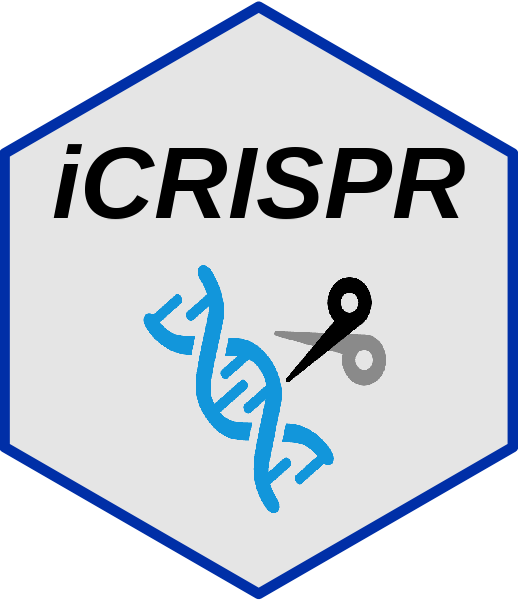

<!-- README.md is generated from README.Rmd. Please edit that file -->

```{r, include = FALSE}
knitr::opts_chunk$set(
  collapse = TRUE,
  comment = "#>",
  fig.path = "man/figures/README-",
  out.width = "100%"
)
devtools::load_all("~/Documents/R/CRISPR/iCRISPR/")
library(badger)
```

```{r include=FALSE,eval=FALSE}
library(hexSticker)
showtext::showtext_auto()
sticker("~/Documents/R/test/icons/crispr.png",
  package = "iCRISPR",
  p_size = 27, p_color = "black", p_fontface = "bold.italic", p_family = "Comic Sans MS",
  s_x = 1, s_y = .7, s_width = 0.6, s_height = 0.6,
  h_fill = "grey90", h_color = "#002fa7",
  filename = "man/figures/iCRISPR.png", dpi = 300
)
```


# iCRISPR 

<!-- badges: start -->
`r badge_custom("blog", "@asa", "blue", "https://asa-blog.netlify.app/")`
`r badge_cran_download("iCRISPR", type = "grand-total")`
`r badge_cran_download("iCRISPR", type = "last-month")`
`r badge_cran_release("iCRISPR","green")`
`r badge_devel("Asa12138/iCRISPR", color = "green")`
<!-- badges: end -->

The goal of iCRISPR is to ...

## Installation

You can install the development version of iCRISPR from [GitHub](https://github.com/) with:

``` r
# install.packages("devtools")
devtools::install_github("Asa12138/iCRISPR")
```
