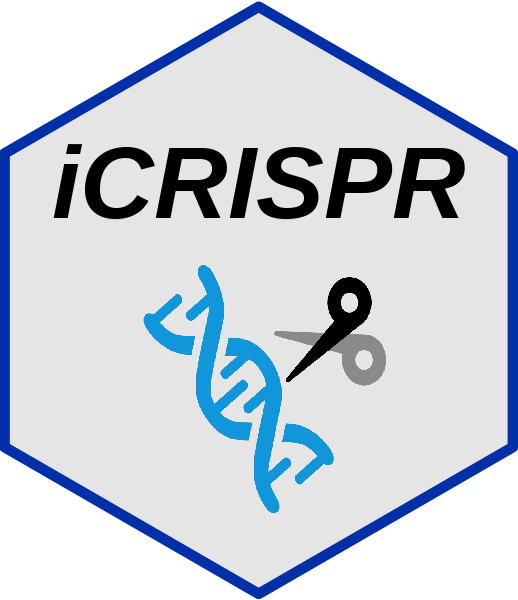

<!-- README.md is generated from README.Rmd. Please edit that file -->

# iCRISPR 

<!-- badges: start -->

[](https://asa-blog.netlify.app/)
[](https://cran.r-project.org/package=iCRISPR)
[](https://cran.r-project.org/package=iCRISPR)
[](https://cran.r-project.org/package=iCRISPR)
[](https://github.com/Asa12138/iCRISPR)
<!-- badges: end -->

The goal of iCRISPR is to …

## Installation

You can install the development version of iCRISPR from
[GitHub](https://github.com/) with:

``` r
# install.packages("devtools")
devtools::install_github("Asa12138/iCRISPR")
```
